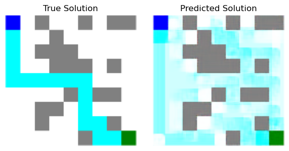
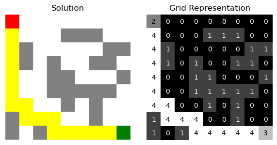
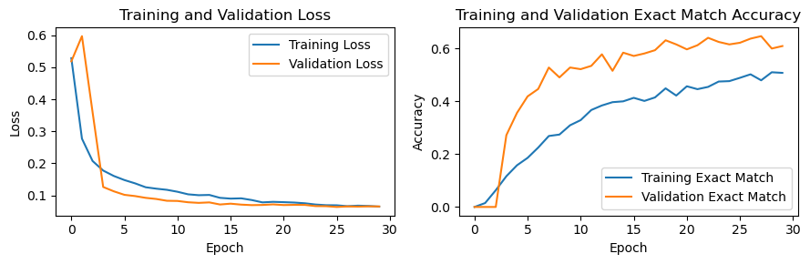
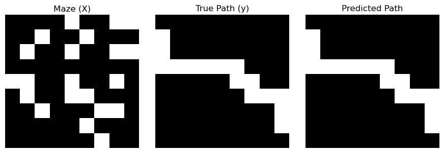
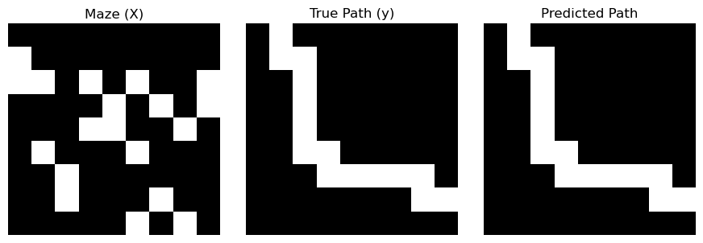
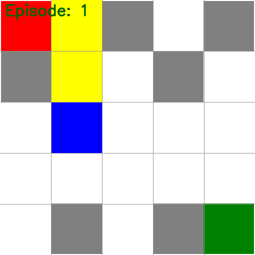
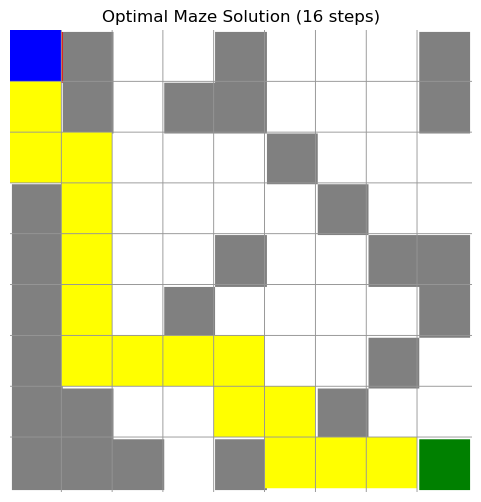

# MAZE SOLVER WITH DEEP LEARNING

**Problem:** We have 10 unsolved 9x9 mazes. Our goal is to predict correctly 10 out of 10 mazes

**Question:** What is the best way to solve mazes using deep learning?

We know mazes can be solved easily with current algorithms such as A* and Dijkstra's. However, we want to see how deep learning can solve this problem.

**Methodology**:
We experienced a lot throughout this project. Initially, two approaches came to mind: 
- generating synthetic data 
- and using reinforcement learning to let the machine learn to solve mazes on its own.

## Approach 1: Image Generation
### Overview
We began by designing a maze generator with customizable sizes, producing 2,000 maze images and 2,000 solution images.

With this data in hand, the question was how to use it effectively. We tested many models and methods to solve the problem. Then, we decided to use only one model for this approach to compare different data processing methods.

<p align="center">Table 1: Convolutional Neural Network for Image Generation Approach</p>

| Layer (type)                | Output Shape  | Param #  |
|-----------------------------|--------------|---------:|
| conv2d_12 (Conv2D)          | (None, 9, 9, 32)  | 1,184   |
| batch_normalization_10      | (None, 9, 9, 32)  | 128     |
| dropout_10 (Dropout)        | (None, 9, 9, 32)  | 0       |
| conv2d_13 (Conv2D)          | (None, 9, 9, 64)  | 18,496  |
| batch_normalization_11      | (None, 9, 9, 64)  | 256     |
| dropout_11 (Dropout)        | (None, 9, 9, 64)  | 0       |
| conv2d_14 (Conv2D)          | (None, 9, 9, 128) | 73,856  |
| batch_normalization_12      | (None, 9, 9, 128) | 512     |
| dropout_12 (Dropout)        | (None, 9, 9, 128) | 0       |
| conv2d_15 (Conv2D)          | (None, 9, 9, 64)  | 73,792  |
| batch_normalization_13      | (None, 9, 9, 64)  | 256     |
| dropout_13 (Dropout)        | (None, 9, 9, 64)  | 0       |
| conv2d_16 (Conv2D)          | (None, 9, 9, 32)  | 18,464  |
| batch_normalization_14      | (None, 9, 9, 32)  | 128     |
| dropout_14 (Dropout)        | (None, 9, 9, 32)  | 0       |
| conv2d_17 (Conv2D)          | (None, 9, 9, 1)   | 33      |

Our CNN model is designed to predict paths in mazes using the following components:

- **Convolutional Layers**: Multiple layers with increasing filters (32, 64, 128) to capture features from basic to complex.
- **Batch Normalization**: Stabilizes and speeds up training by normalizing outputs, reducing internal covariate shift.
- **Dropout Layers**: Prevents overfitting by randomly dropping units, ensuring robust feature learning.
- **Final Layer**: Outputs a single channel representing the predicted path.
- The model was compiled with the Adam optimizer and binary cross-entropy loss, using a custom exact match accuracy metric.

------------
### **Attempt 1**

First, we treated the images as pictures and fed all unsolved and solved maze images to a CNN. The model successfully recreated walls, start points, and end points, but not the path. 

<p align="center">Illustraion 1: Failed Attempt to Create Solution Image from Unsolved Mazes</p>




We realized this approach was incorrect and decided to feed only images with solutions to predict unsolved mazes.

### **Attempt 2**

In our second trial, we used mazes with solutions to train the model. We initially tried using low-dimensional images, but the results were not satisfactory.

When we struggled with coding, we remembered the core of CNNs: converting images into matrices of values (such as colors and pixels). This led us to manually encode the mazes. Since maze cells are square and resemble pixels, and there are only five distinct colors, we encoded them using just five values.

To achieve this, we reduced the image size to match the maze dimensions, making each element exactly one pixel. Based on these images, we created grid matrices that mapped colors to numbers:

- 0 - blank
- 1 - wall
- 2 - start
- 3 - goal
- 4 - path

<p align="center">Illustraion 2: Encoding Mazes</p>



We separated the path matrices as the target variable (Y) and fed them to the CNN.

<p align="center">Illustraion 3: Split X and y - First Trial</p>


However, problems arose as the model performed poorly. We tried different models and increased the training size to 5,000 pairs of mazes and solutions, but still achieved 0% match.

Then, we realized that splitting the input (X) into channels might work. We used one-hot encoding to split X into three channels: walls, start, and goal. The target (Y) was the path.

<p align="center">Illustraion 4: Split X to Channels</p>


- An X is now 3D array (3 channels), size 9x9x3
- An y is now 2D array, size 9x9

Feeding X with y to the model yielded better results.

### Training the model
The graphs show training and validation loss, along with exact match accuracy over 30 epochs. The loss decreases steadily, indicating effective learning, with validation loss consistently lower, suggesting good generalization. The exact match accuracy is lower due to a custom metric that only counts 100% matches, making it a stringent measure. Despite this, both accuracies improve over time, with validation slightly higher, showing the model's ability to generalize. This approach emphasizes achieving perfect maze solutions, aligning with our goal.

<p align="center">Illustraion 5: Train and Loss - CNN with Encoded Input</p>



Although the accuracy appears low due to the strict 100% match requirement, the predicted results are actually quite good. This indicates that the model is effectively learning to solve the mazes, even if not every prediction is a perfect match.

Eaxmple
```
160/160 ━━━━━━━━━━━━━━━━━━━━ 1s 7ms/step - accuracy: 0.9610 - exact_match_accuracy: 0.3620 - loss: 0.1042 - val_accuracy: 0.9698 - val_exact_match_accuracy: 0.5344 - val_loss: 0.0786
Epoch 13/30
```

The high accuracy, over 96%, can be explained by the imbalance in the target array y. Most values in y are 0 because the path occupies only a small portion of the maze. This class imbalance leads to high accuracy, as the model correctly predicts the majority class (non-path pixels). This imbalance is inherent to how mazes are structured, and there's little that can be done to change it.

<p align="center">Illustraion 6: Performance on Test Set - CNN with Encoded Input</p>




When applied to the 10 real mazes, the performance was impressive, with 7 out of 10 mazes solved correctly.


<p align="center">Illustraion 7: Performance on 10 Real Mazes - CNN with Encoded Input</p>


### Conclusion  
The model already performs well, but our goal is to solve 10 out of 10 mazes. This method has several advantages, such as being easy to interpret, aligning closely with the nature of CNNs, and effectively capturing spatial hierarchies. However, there are downsides, such as the need for synthetic data for training and testing. Considering the time and effort involved, it may not be as efficient as using simpler algorithms like Dijkstra's.

From here, we explore another approach: solving mazes with reinforcement learning (RL). This method has the advantage of not requiring generated data; all we need is a single image of the maze we want to solve.


--------
## Approach 2: Reinforcement Learning for Maze Solving with Deep Q-Networks
### Overview  
We trained a reinforcement learning agent to solve a maze using a Deep Q-Network (DQN). The process starts by taking an image of a maze and converting it into a grid-based format. The agent then learns to navigate from the start to the end using a convolutional neural network (CNN). We visualize both the learning process and the final solution.  

By reusing our previous approach of encoding the maze as a grid, we focus on building the CNN and training the Deep Q agent. 

### Main componet
- State Representation  
- Convolutional Neural Network Model 
- The Agent

### State Representation  
Each state is represented as a **5×5×3** array. The first part of the array shows a small 5×5 window around the agent’s position, marking walls as 1 and open paths as 0. The second part represents the Y-distance to the goal, and the third part represents the X-distance, both normalized between 0 and 1. This structured input helps the CNN understand the maze environment.  

The CNN processes this 5×5×3 input and outputs four Q-values, each representing a possible movement: up, right, down, or left.  

### Convolutional Neural Network Model  
The CNN consists of an input layer, a convolutional layer with 32 filters, a flattening layer, and two dense layers. The final output layer contains four neurons, corresponding to the four possible actions.  

<p align="center">Table 2: Convolutional Neural Network for RL Approach</p>

| Layer                 | Output Shape     | Parameters |
|----------------------|-----------------|-----------:|
| Input Layer         | (None, 5, 5, 3)  | 0         |
| Conv2D (32 filters) | (None, 3, 3, 32) | 896       |
| Flatten             | (None, 288)      | 0         |
| Dense (64 neurons)  | (None, 64)       | 18,496    |
| Output (4 neurons)  | (None, 4)        | 260       |

### Action and Reward System  
The agent can move up, right, down, or left. It earns a reward of +10 for reaching the goal, but loses 1 point for hitting a wall or moving out of bounds. If the agent gets closer to the goal, it gains a small reward of +0.1, while moving away results in a penalty of -0.05. Repeating the same move is discouraged by a -0.1 penalty.  

### Training the Agent  
The agent is trained using two models: a main model and a target model, which helps keep training stable. Past experiences are stored in memory, and the agent balances exploring new paths with making optimal moves using an epsilon-greedy strategy.  

During training, the agent starts at a random position in the maze. It chooses an action, moves, and receives a reward. This experience is stored and used to update its knowledge. The process continues for many episodes until the agent learns to reach the goal efficiently.

<p align="center">Illustraion 8: Solving Maze with RL</p>






### To summaruze what happened

- The agent observes its current state (5×5 window + distance to goal)
- The CNN processes this state and outputs Q-values for each action
- The agent selects an action (using epsilon-greedy)
- The environment returns a new state and reward
- This experience is stored in memory
Periodically, the agent learns by sampling experiences and updating the CNN
- As training progresses, the CNN gets better at predicting Q-values
The agent starts making better decisions and solves the maze more efficiently

### Conclusion  
By encoding the maze as a structured grid and using a CNN-based DQN, we successfully trained an agent to solve all 10 mazes. The learning process improved over time as the agent refined its strategy. Further improvements could include optimizing the network, tuning hyperparameters, or applying this method to larger and more complex mazes.


### Author contribution
**An Nguyen:** CNN with encode - ALL, RL - 80%

**Phuong Thao Hoang:** CNN pure - 80%. RL - 20%